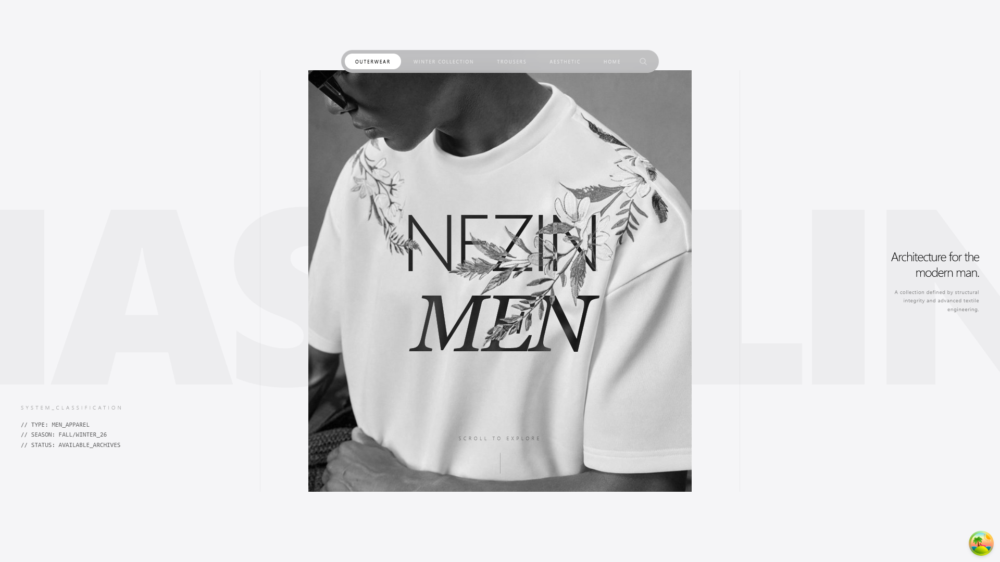

# NEZIN // DIGITAL_ARCHIVE_v2.6

[](https://server-1-1-6g3a.onrender.com/)
[](https://reactjs.org/)
[](https://www.mongodb.com/)

**NEZIN** is an immersive, high-performance e-commerce platform and archival system. It merges industrial design philosophy with a technical, "command-center" aesthetic, providing a seamless experience for both users and administrators.

---

## ⚡ CORE_STACK

### Frontend HUD (Heads-Up Display)
* **Smooth Motion:** `Lenis` for inertial scrolling and `GSAP` for complex parallax transitions.
* **Interactions:** `Framer Motion` for layout animations and micro-interactions.
* **Authentication:** `Firebase Auth` (Email/Password & Google) for secure user nodes.
* **Data Orchestration:** `TanStack Query (React Query)` + `Axios` for robust server-state management.
* **UI Architecture:** Tailwind CSS with custom **Crenzo** and **Monospace** typography.

### Backend Core
* **Runtime:** `Node.js` with `Express.js`.
* **Database:** `MongoDB` for flexible, nested archival structures.
* **Asset Pipeline:** `ImgBB API` integration for automated high-speed image hosting.

---

## 🛠 ARCHITECTURE_MAP

The system operates on a decentralized structure where the frontend communicates with a Render-hosted Node.js API, while authentication is handled via the Firebase security layer.


---

## 🚀 INSTALLATION_REQUISITION

### 1. Repository Access
```bash
git clone [https://github.com/itsSopno/NEZIN.git]
cd nezin-archive

cd client
npm install
npm run dev
cd server
npm install
# Configure your .env variables:
# PORT=5000
# MONGO_URI=your_mongodb_uri
# IMGBB_KEY=your_imgbb_key
npm start


